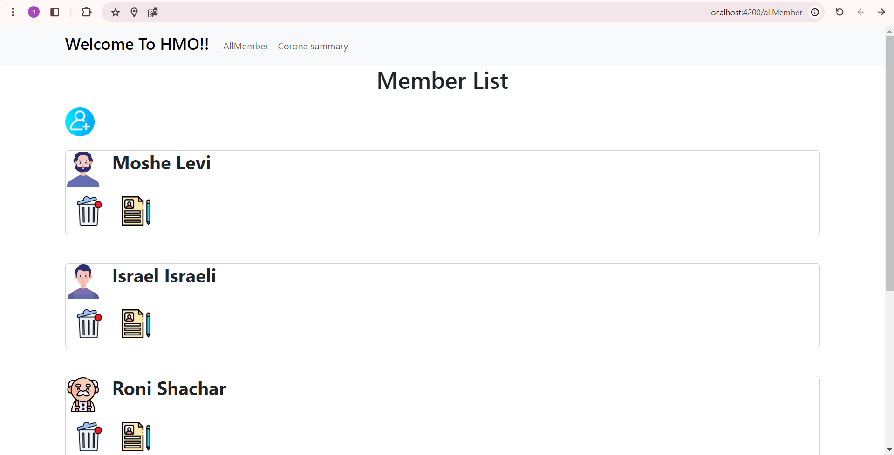
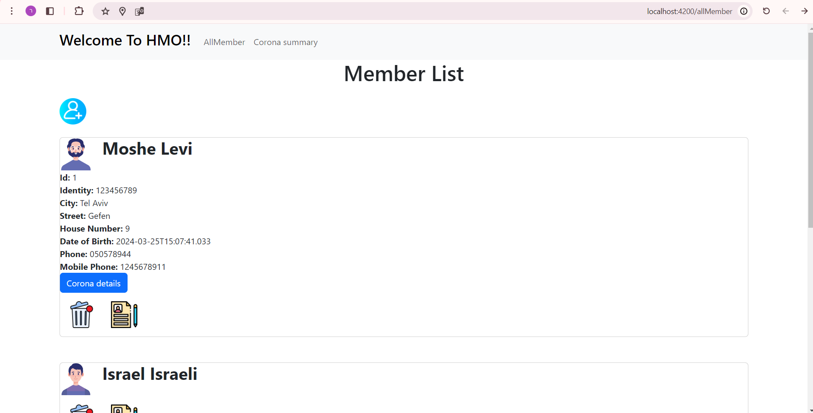
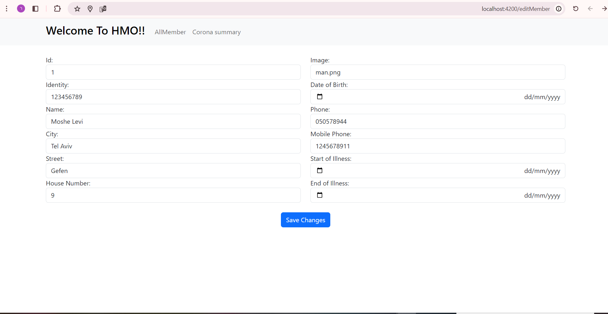
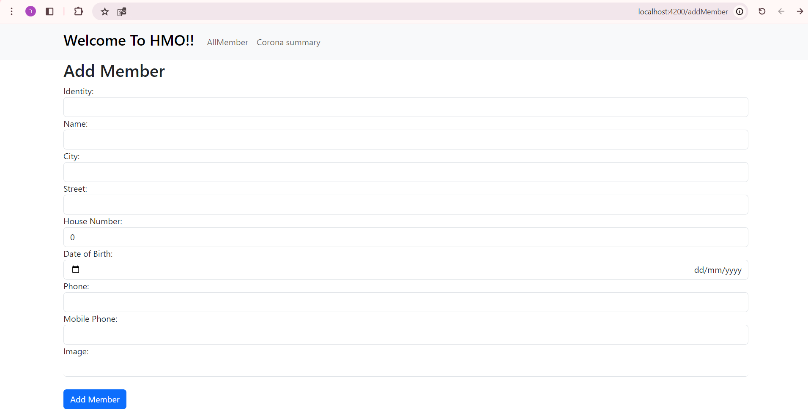
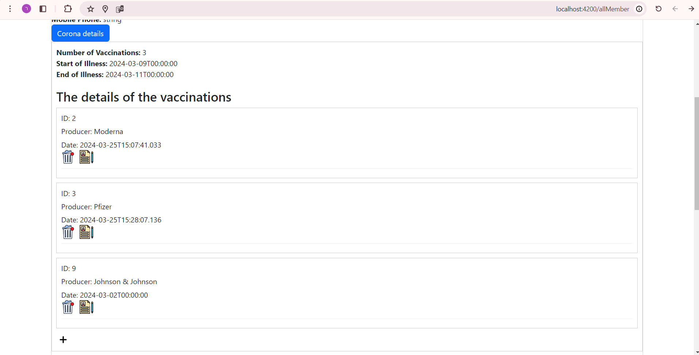
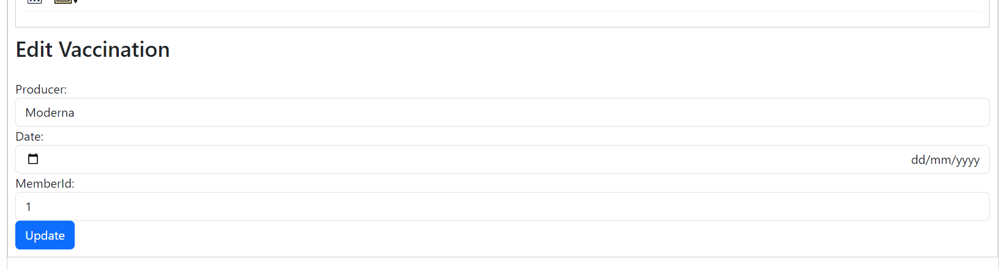
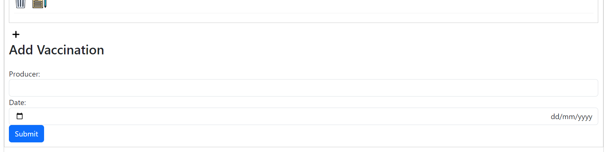
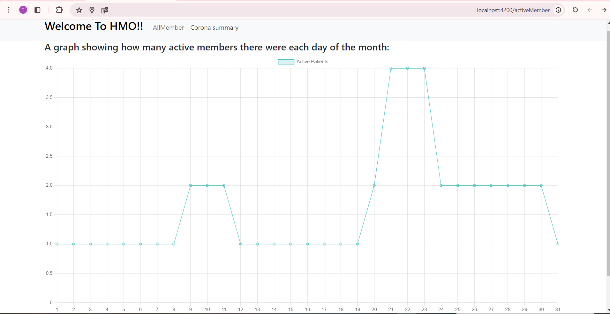
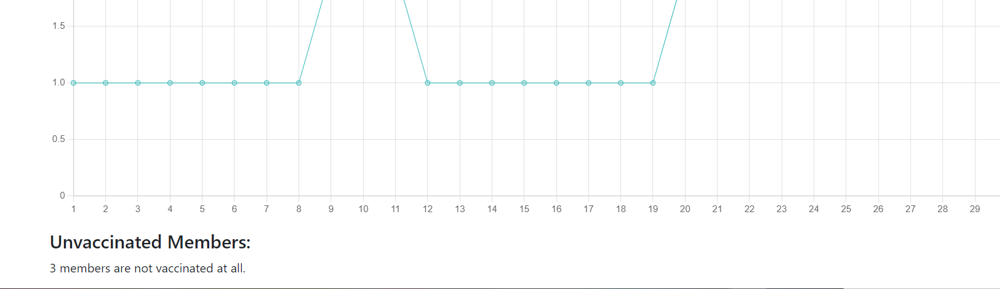

השימוש בתוכנת ניהול חברי קופ"ח:

בכל מסך קיימים למעלה קישורים למסכים השונים - למסך החברים ולמסך ה"סיכום קורונה".

מסך החברים:

כעת אנו רואים את רשימת החברים - שם ותמונת פרופיל של כל חבר.

כדי לראות את פרטיו של חבר מסוים, נלחץ עליו:

כדי לערוך / למחוק חבר מסוים נלחץ על האיקון המתאים בשורת החבר.

דף העריכה יראה כך:

 

כדי להוסיף חבר חדש למערכת, נלחץ על אייקון ההוספה בצד שמאל של המסך, וזה הדף שנראה:

 
  

בפרטי החבר שהצגנו לעיל, ניתן ללחוץ על כפתור Corona Details, ולראות את פרטי הקורונה שלו:

 

כדי לערוך/למחוק חיסון מסוים נלחץ על האיקון המתאים בשורת החיסון.

עריכת החיסון תראה כך:

  

אם מספר החיסונים לחבר אינו עולה על 4 נוכל לראות את איקון הוספת חיסון ולהוסיף כך:

  

  

נעבור למסך סיכום קורונה ע"י לחיצה על הקישור Corona Summary:

 

כעת אנו רואים גרף המייצג את מספר הימים בחודש, ועבור כל יום מציג את מס' החולים הפעילים באותו היום.

אם נגלול את הדף נוכל לראות סיכום של מס' החברים שאינם מחוסנים כלל:

 

 
הערות:

בהוספת חבר, מוסיפים את פרטיו האישיים בלבד בלי קשר לפרטי החיסונים שלו. רק לאחר שהחבר נוסף בהצלחה, ניתן להוסיף/לערוך/למחוק את חיסוניו. 

בוצעו בדיקות תקינות לקלטים הנדרשים.

איך להריץ:

על מנת להקים את הפרויקט ראשית יש להריץ את השרת בתוכנת Visual Studio (לראות שה- Swagger נפתח),

ולאחר מכן להריץ את התוכנה ע"י פקודת ng s בשורת הפקודה(כאשר הניתוב הוא לתיקיית הפרויקט).

כדי להתקין את הDB במחשב ניתן לעשות זאת ע"י הרצת הפקודות הבאות בשרת:

יש לפתוח את Package Manager Console ולעמוד על פרוייקט Data.

יש להריץ: <Add-Migration <MigrationName

ואח"כ יש להריץ Update-Database

הDB התעדכן!

התוכנה נכתבה ב:  Angular | .NET.

